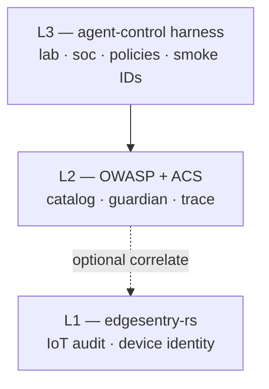

# agent-control documentation

Open-source **runtime control plane for AI agents**, aligned with the [Agent Control Standard (ACS)](https://agentcontrolstandard.ai) and OWASP Gen AI / Agentic Top 10.

This site holds detailed design and operations docs. For a short overview:

- **Humans** — [README](../README.md) on GitHub
- **Coding agents** — [AGENTS.md](../AGENTS.md) on GitHub
- **Programme plan** — [PLAN.md](../PLAN.md) (submission schedule, internal)

## Cap Vista programme

We target **CS02** (adversarial AI security testing / Guardian Lab) as primary and **CS01** (agentic SOC) as secondary, with one platform story: *the lab proves security; SOC reuses the same policy pack.*

Submission deadline: **30 June 2026, 13:00 SGT**.

!!! note "ACS disclaimer"
    This repository is an ACS-aligned **reference implementation**. The [ACS specification](https://github.com/Agent-Control-Standard/ACS) remains authoritative. See [ACS alignment](submission/acs-alignment.md).

## Quick links

| Topic | Page |
|-------|------|
| Clone, build, run | [Getting started](getting-started.md) |
| L1 / L2 / L3 boundaries | [Security boundary](architecture/security-boundary.md) |
| Crate and directory map | [Repository layout](architecture/repo-layout.md) |
| On-prem / air-gap | [On-prem deployment](operations/on-prem.md) |
| Issue roadmap | [Roadmap](submission/roadmap.md) |

## Layered architecture

**One line:** *edgesentry-rs seals what the device saw; OWASP names agent risks; ACS enforces and records agent actions; agent-control fills the gaps.*
