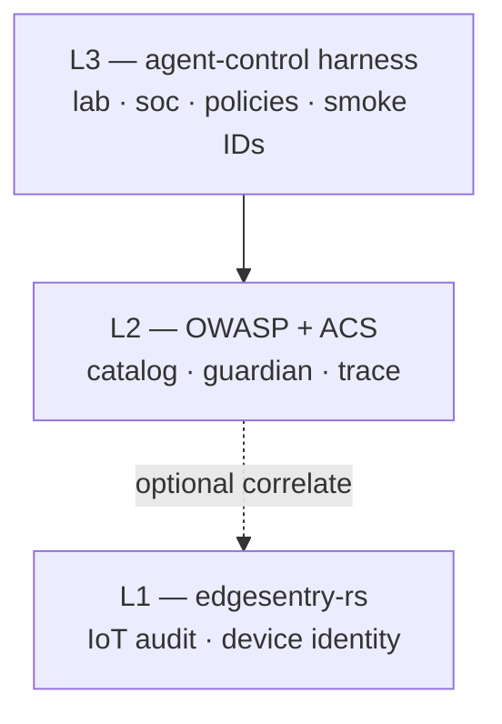

# agent-control documentation

Open-source **runtime control plane for AI agents**, aligned with the [Agent Control Standard (ACS)](https://agentcontrolstandard.ai) and OWASP Gen AI / Agentic Top 10.

| Audience | Start here |
|----------|------------|
| **Humans** | [README](../README.md) on GitHub |
| **Coding agents** | [AGENTS.md](../AGENTS.md) → [Programme plan](plan/index.md) |
| **Cap Vista plan (full)** | [Programme plan index](plan/index.md) |

## Cap Vista programme

We target **CS02** (adversarial AI security testing / Guardian Lab) as primary and **CS01** (agentic SOC) as secondary.

Submission deadline: **30 June 2026, 13:00 SGT**.

!!! note "ACS disclaimer"
    This repository is an ACS-aligned **reference implementation**. The [ACS specification](https://github.com/Agent-Control-Standard/ACS) remains authoritative. See [ACS alignment](submission/acs-alignment.md).

## Quick links

| Topic | Page |
|-------|------|
| Clone, build, run | [Getting started](getting-started.md) |
| Programme plan (was `PLAN.md`) | [Plan index](plan/index.md) |
| L1 / L2 / L3 boundaries | [Purpose](plan/purpose.md) · [Security boundary](architecture/security-boundary.md) |
| Submission DoD | [Submission DoD](plan/submission-dod.md) |
| P0 smoke suite | [P0 smoke suite](plan/p0-smoke-suite.md) |
| W1–W5 schedule | [Schedule](plan/schedule.md) |
| On-prem / air-gap | [On-prem deployment](operations/on-prem.md) |

## Layered architecture

**One line:** *edgesentry-rs seals what the device saw; OWASP names agent risks; ACS enforces and records agent actions; agent-control fills the gaps.*
